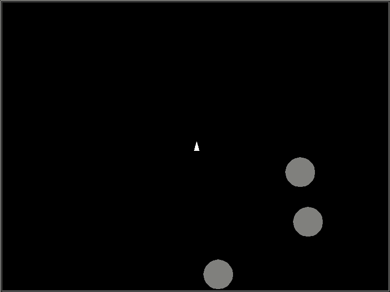

# PyAsteroids

## Overview

This is a simple Asteroids-like game written in Python using only built-ins,
the standard library, and turtle graphics to demonstrate basic programming
and game development concepts.

Concepts covered include:

- Object Oriented Programming and Design
- Graphics Programming
- Game Physics
- Vector Mathematics

## Getting Started

Make sure you have Python 3.7 or greater installed on your computer (it will
probably work on older Python 3 versions, but I've only tested on >3.7). If
not, [go here](https://www.python.org/about/gettingstarted/) to learn how to
download and install for your OS.

Once installed, you can clone this repo, or download the asteroids.py file
and run it with `python3 asteroids.py`.

## Gameplay

## WSAD Keyboard Controls:

- W: Forward thrust (increases velocity in the direction the ship is pointed)
- S: Aft thrust (increases velocity in the direciton opposite the ship is pointed)
- A: Rotate left
- D: Rotate right
- Space: Shoot

When you shoot an asteroid, it will break apart into a random number of smaller
fragments moving at random velocities. To clear a level, shoot all the asteroids
and their fragments until none are left. Each level will spawn more asteroids than
the next. Object of the game is to see how far you can get before you run out of
ships.

When the game is over, your ship will not respawn. At this point you can restart
the game by pressing `r`. You can end the game at any time by pressing `backspace`.

Have fun!
